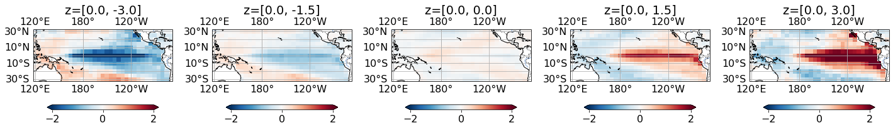
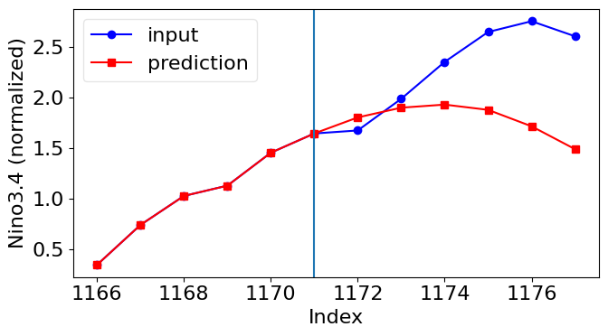
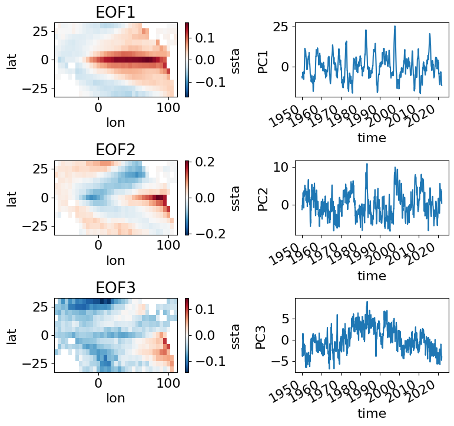
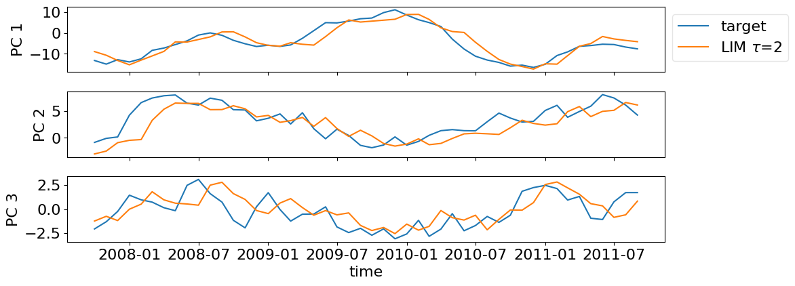

# Tutorials


This repository includes my tutorials for data-driven methods for climate science applications. 
You can find the following tutorials:


1. **AE_VAE/**: Tutorial on autoencoders and Variational Autoencoders for SSTA in the tropical Pacific and SLP over the Atlantic

     


2. **MLP_timeseries/**: Introduction to multi-layer perceprons for time-series forecasting.

     

3. **EOF/**: Empirical orthogonal function analysis (PCA for spatio-temporal data).

     

4. **LIM/**: Linear inverse model (Dynamical mode decomposition) for SSTA field prediction.

     


## Installation

Due to dependencies I recommend using conda. A list of packages is provided in the 
'condaEnv.yml' file. The following steps set up a new environment with all required packages:
1. Install packages: 
```
conda env create -f condaEnv.yml
```
2. Activate environment:
```
conda activate tutorialEnv
```

*Note: If you don't have a Nvidia grafic card you need to comment the line including cudatoolkit in the condaenv.yml file* 